# 🍔 Chai Nashta - React Native Food Delivery App

A modern and fully functional **Food Delivery Mobile Application UI** built using **React Native + Expo + React Navigation**.

This project was developed as a navigation-focused assignment to practice all major React Navigation patterns including:

- Stack Navigation
- Bottom Tabs
- Drawer Navigation
- Nested Navigation
- Auth Flow
- Deep Navigation
- Navigation Params
- Programmatic Navigation
- Context API State Management

---

# ✨ Features

## 🔐 Authentication Flow

- Login Screen
- Onboarding Screen
- Persistent Auth State using AsyncStorage
- Logout functionality
- Conditional Navigation

---

## 🏠 Home Module

- Restaurant listing
- Category-wise restaurant filtering
- Functional search
- See All Restaurants screen
- Dynamic restaurant rendering

---

## 🍕 Restaurant Detail

- Dynamic menu rendering
- Restaurant-wise food items
- Add to Cart functionality
- Live cart count

---

## 🔍 Search Module

- Search food items
- Filter by category
- Dynamic food cards
- Navigate to item details

---

## 🍟 Item Detail Module

- Full-screen ImageBackground
- Food details
- Quantity increment/decrement
- Add to Cart
- Go to Cart

---

## 🛒 Cart System

- Functional cart management
- Increase/Decrease quantity
- Remove item
- Dynamic pricing
- Place order
- Order creation

---

## 📦 Orders Module

- Active orders
- Past orders
- Dynamic order history
- Orders badge

---

## 👤 Profile & Drawer

- Custom profile UI
- Custom drawer UI
- Personal Information
- Addresses
- Payment Methods
- Settings
- Help Center
- Logout

---

# 🧭 Navigation Structure

The project uses multiple nested navigators to demonstrate all major React Navigation patterns.

---

# 📌 Navigation Diagram

```txt
RootNavigator
│
├── AuthNavigator
│   ├── Login
│   └── Onboarding
│
└── DrawerNavigator
    │
    ├── TabNavigator
    │   │
    │   ├── HomeStack
    │   │   ├── Home
    │   │   ├── AllRestaurants
    │   │   ├── RestaurantDetail
    │   │   ├── ItemDetail
    │   │   └── Cart
    │   │
    │   ├── Search
    │   ├── Orders
    │   └── Profile
    │
    ├── MyOrders
    ├── Settings
    ├── Help
    ├── PersonalInfo
    ├── Addresses
    └── PaymentMethods
```

---

# 🏗️ Tech Stack

| Technology                   | Usage                   |
| ---------------------------- | ----------------------- |
| React Native                 | Mobile App Framework    |
| Expo                         | Development Environment |
| TypeScript                   | Type Safety             |
| React Navigation             | Navigation System       |
| Context API                  | Global State Management |
| AsyncStorage                 | Persistent Storage      |
| Expo Vector Icons            | Icons                   |
| React Native Gesture Handler | Navigation Gestures     |

---

# 📂 Folder Structure

```txt
src/
│
├── components/
│
├── constants/
│
├── context/
│
├── navigation/
│
├── screens/
│   ├── auth/
│   ├── onboarding/
│   ├── home/
│   ├── tabs/
│   └── drawer/
│
├── styles/
│
├── types/
│
└── utils/
```

---

# ⚙️ Project Setup Guide

## 1️⃣ Clone Repository

```bash
git clone <repository-url>
```

---

## 2️⃣ Install Dependencies

```bash
npm install
```

---

## 3️⃣ Install Expo Navigation Dependencies

```bash
npx expo install react-native-screens react-native-safe-area-context react-native-gesture-handler react-native-reanimated react-native-worklets
```

---

## 4️⃣ Install React Navigation

```bash
npm install @react-navigation/native
npm install @react-navigation/native-stack
npm install @react-navigation/bottom-tabs
npm install @react-navigation/drawer
```

---

## 5️⃣ Install AsyncStorage

```bash
npx expo install @react-native-async-storage/async-storage
```

---

## 6️⃣ Configure Babel

Create or update `babel.config.js`

```js
module.exports = function (api) {
  api.cache(true);

  return {
    presets: ["babel-preset-expo"],
    plugins: ["react-native-reanimated/plugin"],
  };
};
```

---

## 7️⃣ Start Project

```bash
npx expo start
```

---

# 🚀 Functionalities Implemented

## Navigation

- Stack Navigator
- Bottom Tab Navigator
- Drawer Navigator
- Nested Navigation
- Programmatic Navigation
- Screen Transitions
- Navigation Params

---

## Programmatic Navigation Used

```txt
navigate()
goBack()
reset()
openDrawer()
```

---

## State Management

- Auth Context
- Cart Context
- Order Context

---

## Functional Modules

- Search
- Category Filtering
- Cart Management
- Order Creation
- Dynamic Order History
- Persistent Login

---

# 📱 Screens Included

| Screen            | Description             |
| ----------------- | ----------------------- |
| Login             | User authentication     |
| Onboarding        | Intro screen            |
| Home              | Restaurant discovery    |
| All Restaurants   | Full restaurant listing |
| Restaurant Detail | Restaurant menu         |
| Item Detail       | Food item detail        |
| Cart              | Cart management         |
| Orders            | Active & past orders    |
| Profile           | User profile            |
| Personal Info     | User details            |
| Addresses         | Delivery addresses      |
| Payment Methods   | Payment management      |
| Settings          | App settings            |
| Help              | Support section         |

---

# 🖼️ App Screenshots

<table>
<tr>
<td>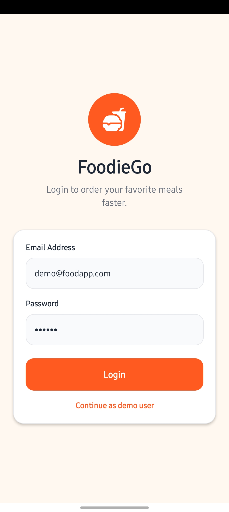</td>
<td>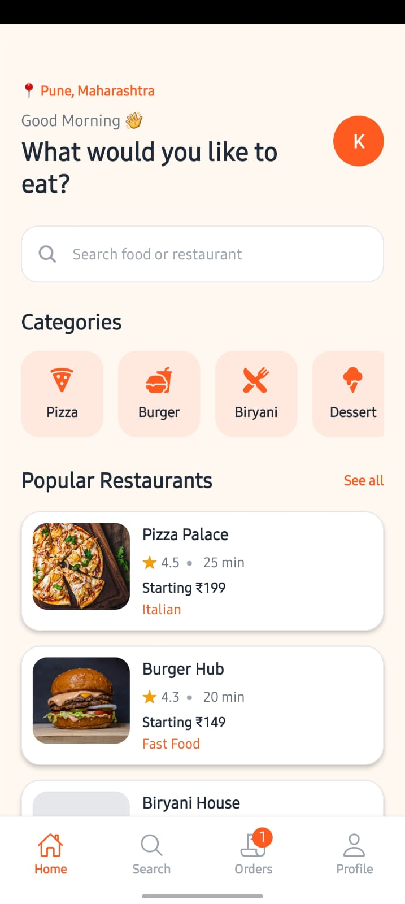</td>
<td>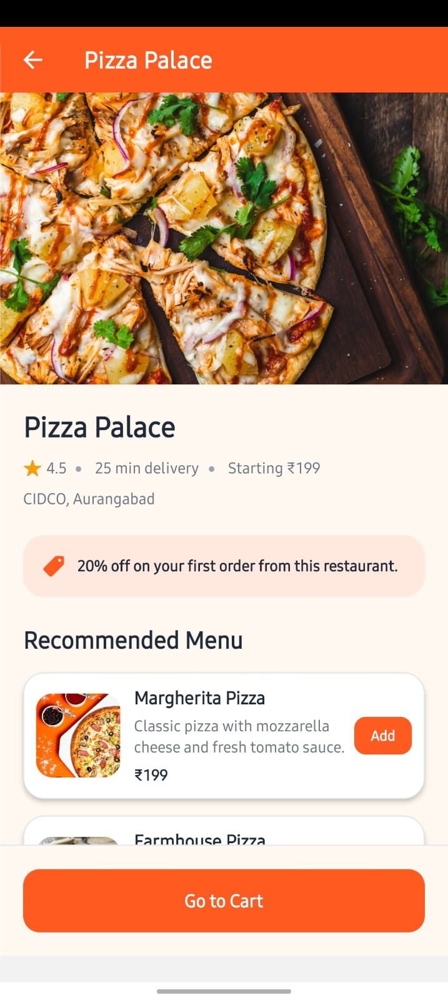</td>
</tr>

<tr>
<td>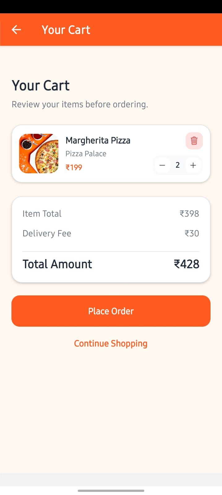</td>
<td>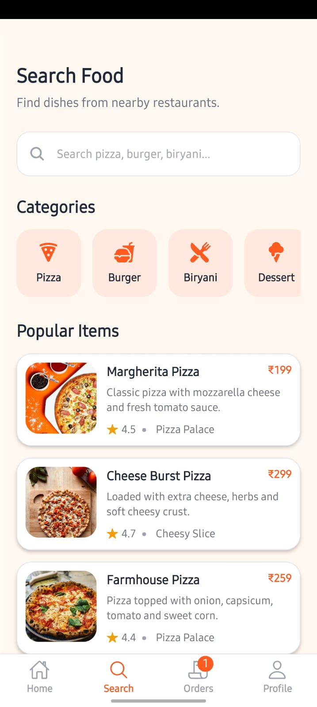</td>
<td>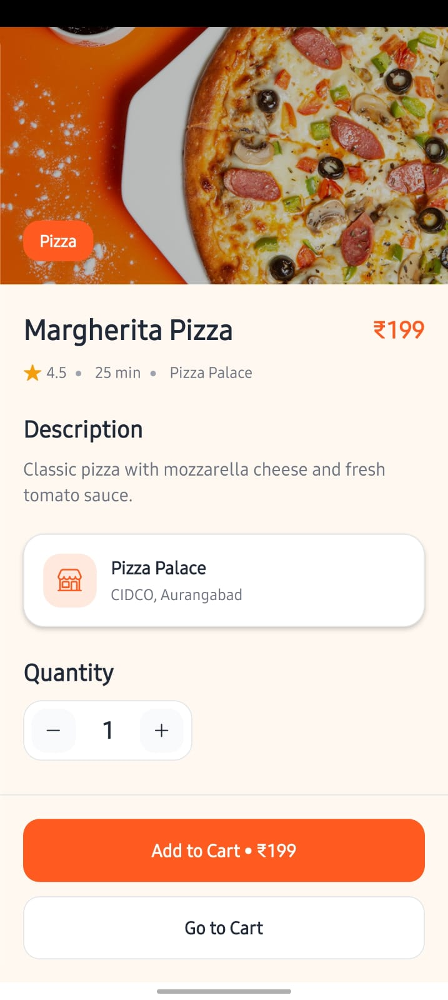</td>
</tr>

<tr>
<td>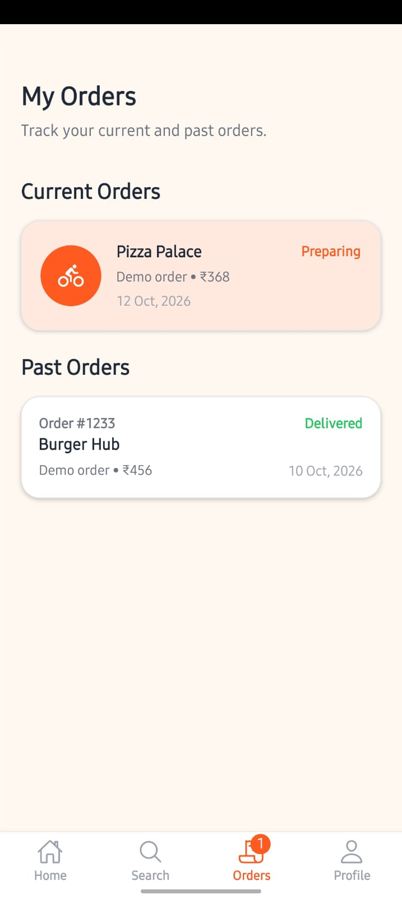</td>
<td>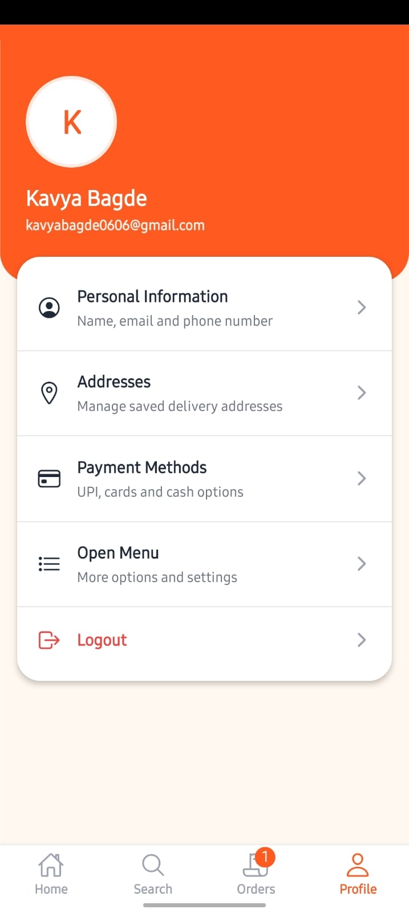</td>
<td>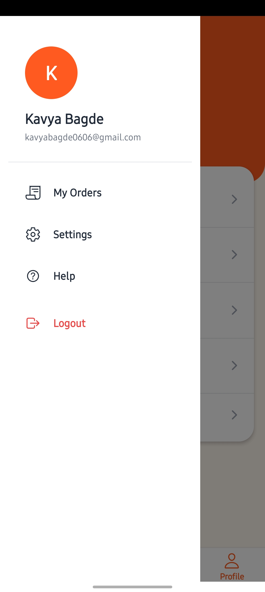</td>
</tr>

<tr>
<td>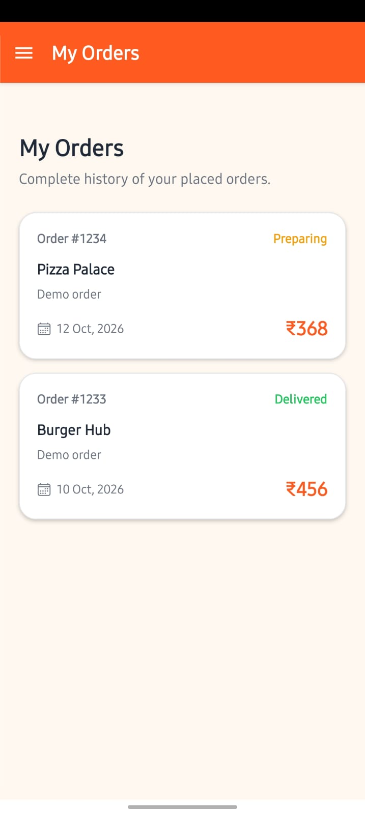</td>
<td>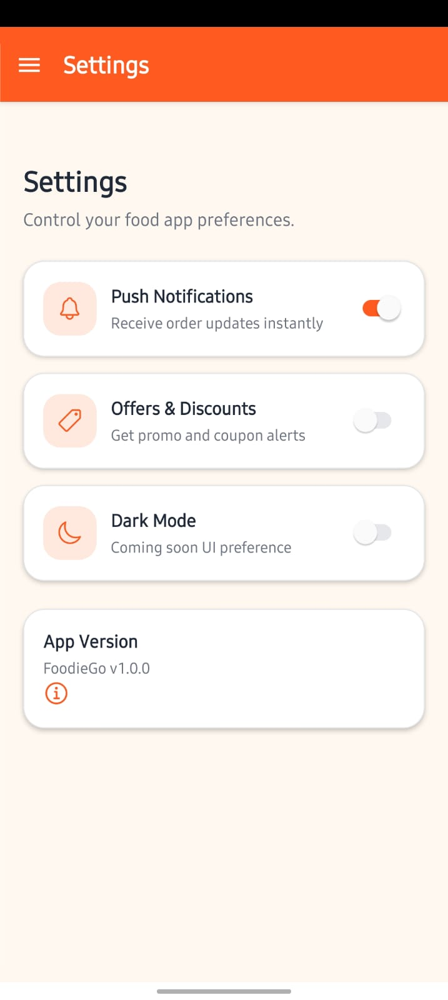</td>
<td>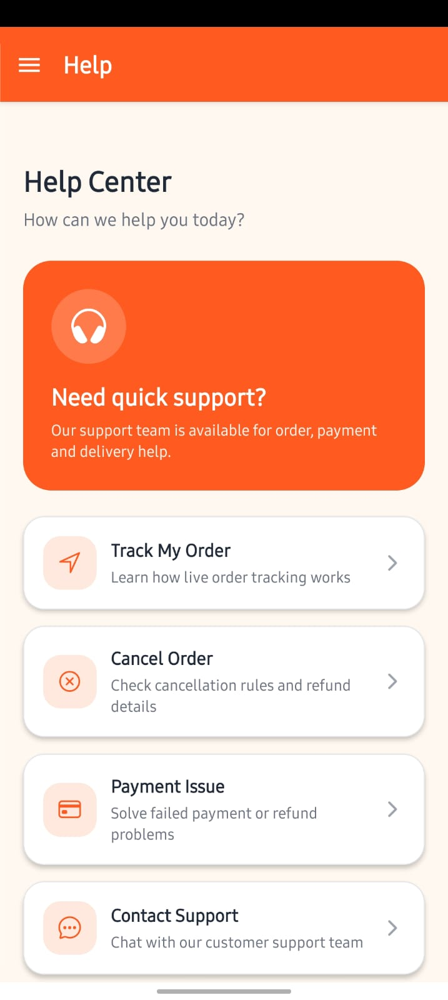</td>
</tr>

<tr>
<td>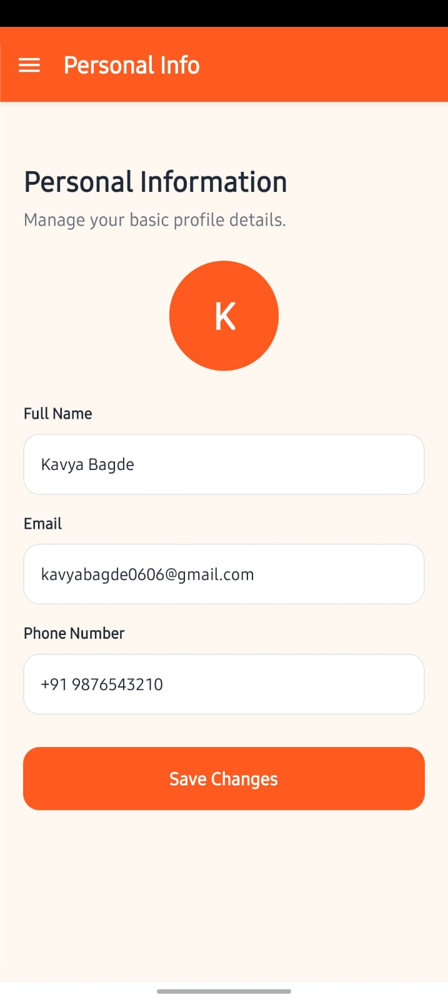</td>
<td>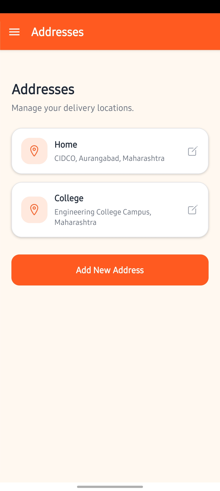</td>
<td>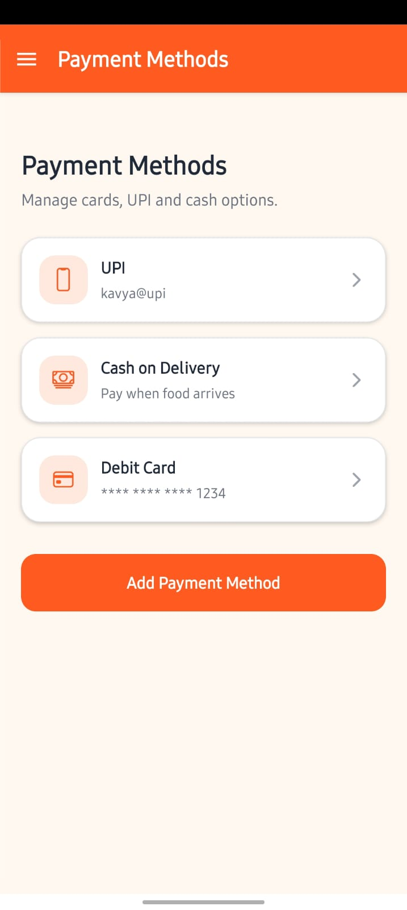</td>
</tr>
</table>

# Demo Video 
<a href="https://youtube.com/shorts/feo9XiCaVlY?si=C1AACIwEQIlNBOeK">Click Me</a>

# 📌 Future Improvements

- Backend Integration
- Real Payment Gateway
- Live Order Tracking
- Firebase Authentication
- Push Notifications
- Dark Mode
- Real API Integration

---

# 👨‍💻 Developed Using

- React Native
- Expo
- TypeScript
- React Navigation
- Context API

---

# 📄 License

This project is built for educational and assignment purposes.
